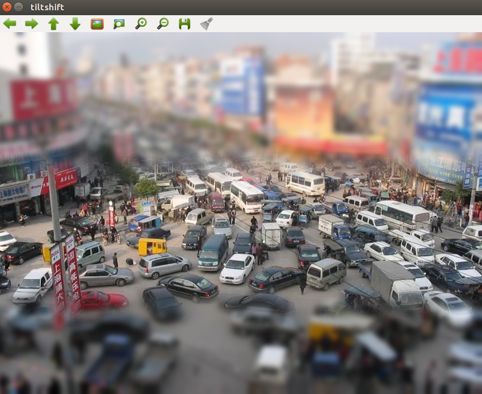
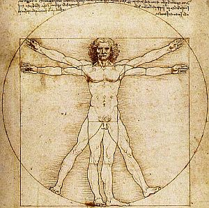
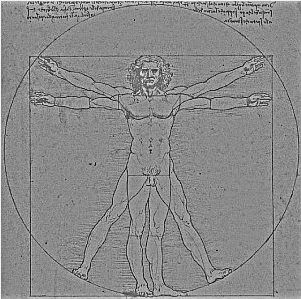
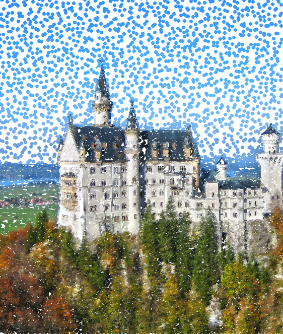

// View this document online at http://andrebfd4.github.io/andrebfd4
// USAR COMANDO asciidoctor index.adoc
= Processamento Digital de Imagens - Exercícios
:description: Esta página serve para expor aplicações em OpenCV e, consequentemente, linguagem C++. Faz parte também da disciplina DCA0445 e exercícios propostos nela. 
:page-layout: docs
:page-description: {description}
:toc: left
:icons: font
:idprefix:

== 1. Primeira unidade

=== 1.1 Cores em negativo

O primeiro exercício proposto é fazer com que o usuário escolha uma região de uma imagem, definida por 2 pontos de entrada, e fazê-la com que ela seja preenchida com as cores em *negativo*. 

====
[[img-sunset]]
.Imagem de exemplo
image::download.jpg[]
====

A partir do código link:regions.cpp[regions.cpp]. como referência, percebe-se que a principal função do programa é fazer com que os componentes RGB da imagem aberta em cores seja invertida. Para isso, definimos os valores de val[0] = val[1] = val[2] = 255, ou seja, durante o algoritmo, estaremos considerando cada componente de cor da imagem. Após isso, atualizamos os índices de cor na matriz definida pelo usuário a partir desses valores, subtraindo assim um valor de 255 de cada pixel, o que caracteriza a imagem em negativo.  

Após definir dois pontos, podemos obter a seguinte saída:

====
[[img-sunset]]
.Imagem de saída
image::saida.png[]
====

=== 1.2 Trocando regiões

O segundo exercício proposto é fazer com que, em uma imagem, possamos dividir a imagem em quatro quadrantes e mudá-los de posição aleatoriamente, formando um quebra-cabeça. 

==== 
[[img-sunset]]
.Imagem de entrada
image::biel.png[]
====

Com o código link:trocaregioes.cpp[trocaregioes.cpp]. é possível trocar as regiões mencionadas a partir de construtores da classe Mat, própria do OpenCV, copiando matrizes e atribuindo tamanho a novas, copiando-as para uma matriz final, a qual será a imagem de saída. Assim, podemos obter imagens como esta:

====
[[img-sunset]]
.Imagem de saída
image::trocaregioes.png[]
====

=== 1.3 Preenchendo regiões

A atividade proposta foi utilizar uma imagem em PeB e nela identificar e contar regiões com buracos. Para isso, não podemos contar com os objetos brancos que tocam a borda da imagem, já que não temos certeza se elas têm bolhas ou não. Logo, eles foram excluídos da imagem utilizada. Além disso, o algoritmo pinta os obejtos com bolha de cinza, para dar destaque à contagem. O código link:contar.cpp[contar.cpp] ainda conta com uma função seedfill, a qual identifica objetos brancos e os preenche com uma cor de rótulo desejada. 

====
[[img-sunset]]
.Bolhas
image::bolhas.png[]
====

====
[[img-sunset]]
.Contagem
image::contar.png[]
====

=== 1.4 Equalização de histogramas

Esta atividade tem o objetivo de criar um fluxo de vídeo (em cores) e convertê-lo para grayscale, para que então possa ser feita a equalização do seu histograma. Esse método tem o propósito de melhorar o contraste de uma imagem por meio de uma distribuição cumulativa de função, isto é: dada uma distribuição de intensidade de tons de cinza em uma imagem, a equalização de histograma fará com que essa quantidade seja mais bem distribuída por todas as possibilidades de tons de cinza que há (256). 
Com base no código link:histogram.cpp[histogram.cpp], foram feitas poucas alterações: foram adicionadas duas matrizes novas (gray e eq), as quais, respectivamente, servirão para o armazenamento da imagem em grayscale e posteriormente para a imagem já equalizada; e foram utilizados dois métodos da documentação em OpenCV, sendo eles o cvtColor() e o equalizeHist(). O código equalize pode ser visto link:equalize.cpp[aqui].

====
[[img-sunset]]
.Frame de entrada
image::equal1.png[]
====

====
[[img-sunset]]
.Frame de saída
image::equal2.png[]
====

=== 1.5 Detector de movimentos
 
O próximo programa feito teve o objetivo de criar um detector de movimentos, tendo uma câmera ligada para fluxo de vídeo. Para a implementação do método de deteccção, foi criada uma função detecta(), a qual se baseia na diferença do valor de um pixel entre um frame e outro e informa em quais pixels houve a detecção. No caso, a imagem que se observa é colorida, mas é convertida para grayscale no método citado. No programa, o usuário pode escolher o valor da diferença entre os valores dos pixels na imagem. É importante ressaltar que valores abaixo de 150 para a diferença podem se mostrar muito sensíveis em diferentes câmeras. Segue o código link:motiondetector.cpp[motiondetector.cpp].

====
[[img-sunset]]
.Saída do programa
image::motion.png[]
====

=== 1.6 Filtros espaciais I 

Na atividade, foi pedido para que fosse implementado um filtro espacial que forneça o laplaciano do gaussiano. Esse processamento, feito em cima do plano onde estão os pixels da imagem, é uma variação do filtro laplaciano que visa eliminar ŕuídos na imagem por meio do filtro gaussiano (smoothing). A máscara para esse filtro pode ser encontrada neste link:https://softwarebydefault.com/tag/laplacian-of-gaussian/[site]. Segue também o código link:laplgauss.cpp[laplgauss.cpp]. 

====
[[img-sunset]]
.Frame de saída
image::laplgauss.png[]
====

=== 1.7 Filtros espaciais II pt. 1

Para finalizar a unidade, tivemos duas atividades. A primeira delas é fazer um programa que realize o efeito *tilt shift*, que supõe desfocar certas áreas da imagem para fazer com que a parte destacada pareça uma miniatura. Para isso, deve ser realizada uma filtragem de borramento (usando o filtro da média 5x5) em uma faixa escolhida pelo usuário, além de poder configurar sua intensidade. Tal ponderação é feita por uma relação entre tangentes hiperbólicas envolvendo duas coordenadas definidas. Foram utilizadas as funções merge(), para criar múltiplos arrays de comprimento unitário, e a função multiply() para multiplicar duas matrizes com um fator de escala. Segue o código link:tiltshift.cpp[tiltshift.cpp].

====
[[img-sunset]]
.Frame de saída

====

=== 1.8 Filtros espaciais II pt. 2

Como última atividade da primeira unidade, foi requisitado fazer o mesmo efeito tiltshift, dessa vez para um vídeo. A única diferença desse código para o anterior é a escrita em vídeo, realizando a mesma função. Para isso, foram declaradas novas variáveis na função main e o processo de escrita feita em um loop contínuo até o fim do vídeo. Infelizmente, as configurações do computador usado não permitem o salvamento em vídeo para exibição neste site. Segue o código link:tiltshiftvideo.cpp[tiltshiftvideo.cpp]

== 2. Segunda unidade

=== 2.1 Filtro homomórfico

Esta atividade tem o propósito de implementar um filtro homomórfico no plano da frequência, ou seja, em primeiro lugar, toma-se a imagem de entrada e nela é aplicada a transformada discreta de Fourier. Em seguida, o filtro homomórfico é aplicado (com os quadrantes da imagem deslocados) e, na sequência, calcula-se a transformada inversa. Para o filtro mencionado, a manipulação matemática é descrita na seção 2 de um artigo publicado no link:http://www.ipcsit.com/vol45/015-ICIKM2012-M0029.pdf[2012 International Conference on Information and Knowledge Management]. Com base no código dft presente no tutorial, foi possível implementar o código link:homomorfico.cpp[homomorfico.cpp] e conseguir imagens filtradas para aplicações em cenas com fraca iluminação.

====
[[img-sunset]]
.Imagem de entrada

====

====
[[img-sunset]]
.Imagem filtrada

====

=== 2.2 Arte com pontilhismo

A última atividade da segunda unidade propõe uma melhoria da arte com pontilhismo, implementada na seção 10 do tutorial, com auxílio do detector de bordas de Canny. Nesse sentido, foi adotada a segunda segustão do exercício, a qual sugere detectar bordas com o algoritmo anterior e, a partir daí, desenhar os círculos. No caso, varre-se toda a imagem procurando valores 255 (branco, indicando borda). O usuário também pode definir o limiar a ser utilizado (valores menores para mais detalhes e vice-versa) e o raio dos círculos impressos na imagem. O código link:cannypoints.cpp[cannypoints.cpp] pode ser conferido.

====
[[img-sunset]]
.Imagem com pontilhismo (limiar 37 e raio 1)

====
