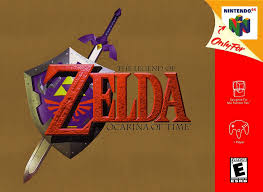

// View this document online at http://andrebfd4.github.io/andrebfd4
= Processamento Digital de Imagens - Exercícios
:description: Esta página serve para expor aplicações em OpenCV e, consequentemente, linguagem C++. Faz parte também da disciplina DCA0445 e exercícios propostos nela. 
:page-layout: docs
:page-description: {description}
:toc: left
:icons: font
:idprefix:

== 1. Primeira unidade

=== 1.1 Cores em negativo

O primeiro exercício proposto é fazer com que o usuário escolha uma região de uma imagem, definida por 2 pontos de entrada, e fazê-la com que ela seja preenchida com as cores em *negativo*. 

====
[[img-sunset]]
.Imagem de exemplo

====

A partir do código link:regions.cpp[regions.cpp]. como referência, percebe-se que a principal função do programa é fazer com que os componentes RGB da imagem aberta em cores seja invertida. Para isso, definimos os valores de val[0] = val[1] = val[2] = 255, ou seja, durante o algoritmo, estaremos considerando cada componente de cor da imagem. Após isso, atualizamos os índices de cor na matriz definida pelo usuário a partir desses valores, subtraindo assim um valor de 255 de cada pixel, o que caracteriza a imagem em negativo.  

Após definir dois ponntos, podemos obter a seguinte saída:

====
[[img-sunset]]
.Imagem de saída
image::saida.png[]
====

=== 1.2 Trocando regiões

O segundo exercício proposto é fazer com que, em uma imagem, possamos dividir a imagem em quatro quadrantes e mudá-los de posição aleatoriamente, formando um quebra-cabeça. 

==== 
[[img-sunset]]
.Imagem de entrada
image::biel.png[]
====

Com o código link:trocaregioes.cpp[trocaregioes.cpp]. é possível trocar as regiões mencionadas a partir de construtores da classe Mat, própria do OpenCV, copiando matrizes e atribuindo tamanho a novas, copiando-as para uma matriz final, a qual será a imagem de saída. Assim, podemos obter imagens como esta:

====
[[img-sunset]]
.Imagem de saída
image::trocaregioes.png[]
====

=== 1.3 Preenchendo regiões

A atividade proposta foi utilizar uma imagem em PeB e nela identificar e contar regiões com buracos. Para isso, não podemos contar com os objetos brancos que tocam a borda da imagem, já que não temos certeza se elas têm bolhas ou não. Logo, eles foram excluídos da imagem utilizada. Além disso, o algoritmo pinta os obejtos com bolha de cinza, para dar destaque à contagem. O código link:contar.cpp[contar.cpp] ainda conta com uma função seedfill, a qual identifica objetos brancos e os preenche com uma cor de rótulo desejada. 

====
[[img-sunset]]
.Bolhas
image::bolhas.png[]
====

====
[[img-sunset]]
.Contagem
image::contar.png[]
====

=== 1.4 Equalização de histogramas

Esta atividade tem o objetivo de criar um fluxo de vídeo (em cores) e convertê-lo para grayscale, para que então possa ser feita a equalização do seu histograma. Esse método tem o propósito de melhorar o contraste de uma imagem por meio de uma distribuição cumulativa de função, isto é: dada uma distribuição de intensidade de tons de cinza em uma imagem, a equalização de histograma fará com que essa quantidade seja mais bem distribuída por todas as possibilidades de tons de cinza que há (256). 
Com base no código link:histogram.cpp[histogram.cpp], foram feitas poucas alterações: foram adicionadas duas matrizes novas (gray e eq), as quais, respectivamente, servirão para o armazenamento da imagem em grayscale e posteriormente para a imagem já equalizada; e foram utilizados dois métodos da documentação em OpenCV, sendo eles o cvtColor() e o equalizeHist(). O código equalize pode ser visto link:equalize.cpp[aqui].